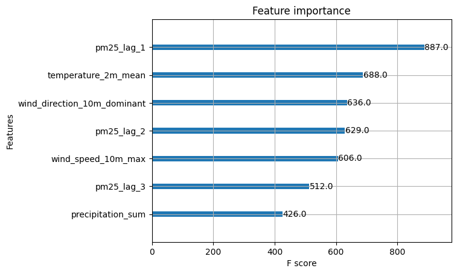
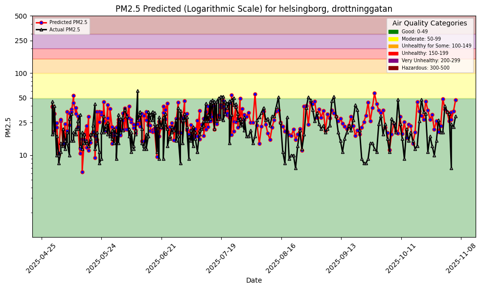
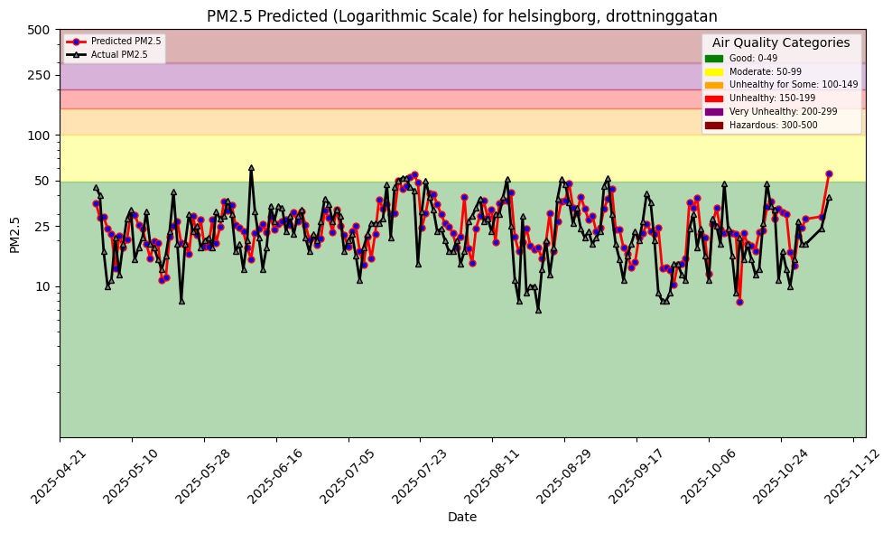
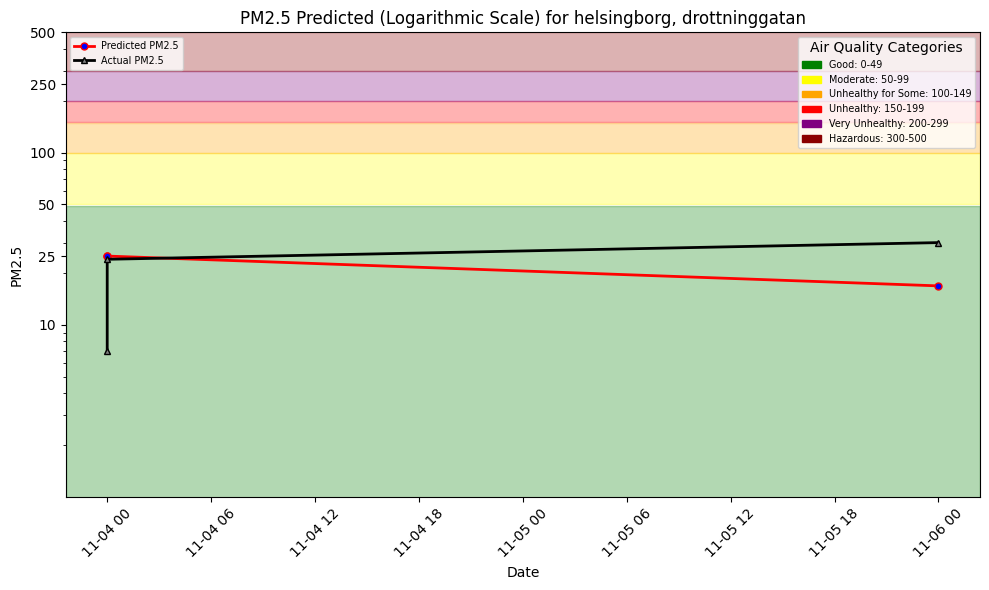
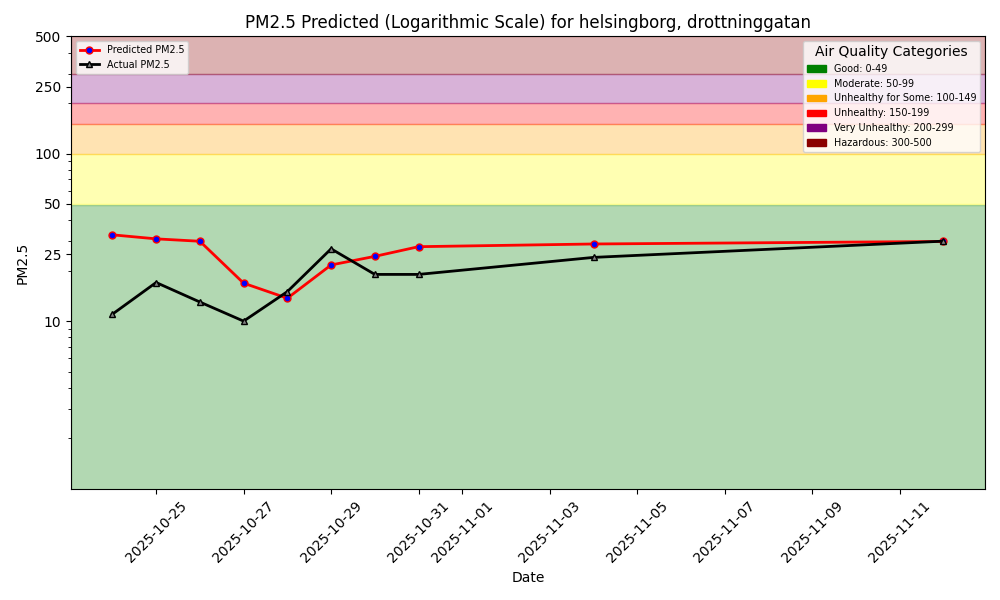

# ID2223 Lab1
Chih-Yun Liu (cyliu4@kth.se)
Hanaè (???@kth.se)

## How to Run
make aq-features id=x
make aq-train id=x
make aq-reference id=x

(x=1 for Drottinggatan; 
x=2 for Ramshogsvagen;
x=3 for Larod)

## Implementation
### Add New Feature (GradeC):
We selected lag_1, lag_2, and lag_3 as new features, which means the pm25 data from 1 day, 2 days, and 3 days before, into the model. And these new feature help significantly on the accuracy. First, the importance of lag features is high for the model(See Figure1). Also, as we can see in the comparison plot with and without lag features, the plot with lag features align more to the ground truth in both training and inferencing(See Figure 2 and 3).

Without New Features (Training)

With New Features (Training)

Without New Features (Inference)

With New Features (Inference)

### Multi-Sensors
1. Select Sensors
Our designated area is "Helsingborg and Landskorna", and the 3 sensors we chose are Drottinggatan, Ramshogsvagen, Larod.
2. .env
We give each sensors an id, and put all the information including url, country, city, street, and csv file path onto .env file with the name always ends with "_id".

3. Notebook
We modify the notebooks for to take sensor id as input through command line. First, we parse the input from the command line and got the attribute "id". Then, 
4. Make File
5. .yml file

